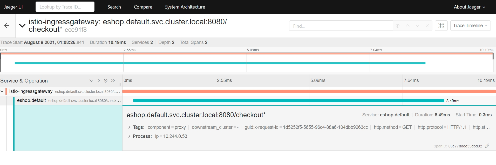

# Observability across microservices using Jaeger & Kube 

## Steps
### Package and Push to Container registry
```
git clone https://github.com/theamitabh/tracing.git

mvn package
docker build -t tracingdemo:7 .
docker login
docker tag tracingdemo:7 amitprem/tracingdemo:7
docker push amitprem/tracingdemo:7
```

### Get azure Kube cluster creds , kube nodes & deploy
```
az aks get-credentials --resource-group rgkube --name amitcluster
kubectl get nodes
kubectl apply -f k8s/deploy.yaml
```
### Check pod & deployment status
```
kubectl get pods
NAME                         READY   STATUS    RESTARTS   AGE
billing-6fd5dbb44d-brtq6     1/1     Running   0          43s
delivery-d6c976fbb-gxfcn     1/1     Running   0          43s
eshop-7bd4997468-fcqls       1/1     Running   0          44s
inventory-68654d7cc8-snhtl   1/1     Running   0          43s
jaeger-787766c5b9-zjggc      1/1     Running   0          42s
logistics-5b9bd77645-r9m42   1/1     Running   0          42s

kubectl get svc
NAME         TYPE        CLUSTER-IP     EXTERNAL-IP   PORT(S)               AGE
billing      ClusterIP   10.0.221.251   <none>        8080/TCP              24m
delivery     ClusterIP   10.0.117.24    <none>        8080/TCP              24m
eshop        ClusterIP   10.0.41.174    <none>        8080/TCP              24m
inventory    ClusterIP   10.0.117.169   <none>        8080/TCP              24m
jaeger       ClusterIP   10.0.249.177   <none>        14268/TCP,16686/TCP   24m
kubernetes   ClusterIP   10.0.0.1       <none>        443/TCP               29m
logistics    ClusterIP   10.0.210.139   <none>        8080/TCP              24m
```

### Port forward API & JAEGERUI ports to localhost
```
kubectl port-forward service/eshop 8080:8080
Forwarding from 127.0.0.1:8080 -> 8080
Forwarding from [::1]:8080 -> 8080

kubectl port-forward service/jaeger 16686:16686
Forwarding from 127.0.0.1:16686 -> 16686
Forwarding from [::1]:16686 -> 16686

```

### Test the checkout 
```	curl http://127.0.0.1:8080/checkout ```

### View Jaeger UI
cess Jaeger UI at http://localhost:16686/

## Jaeger UI Screen
